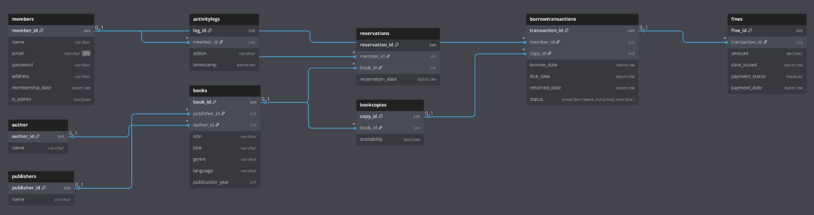

<a id="readme-top"></a>
<br />
<div align="center">
  <h3 align="center">LIBRARY MANAGEMENT SYSTEM</h3>
</div>

---

<details>
  <summary>Table of Contents</summary>
  <ol>
    <li>
      <a href="#about-the-project">About The Project</a>
      <ul>
        <li><a href="#built-with">Built With</a></li>
        <li><a href="#installation">Installation</a></li>
      </ul>
    </li>
    <li>
      <a href="#features">Features</a>
      <ul>
        <li><a href="#user-features">User Features</a></li>
        <li><a href="#admin-features">Admin Features</a></li>
        <li><a href="#system-rules">System Rules</a></li>
      </ul>
    </li>
    <li><a href="#database">Database</a>
      <ul>
        <li><a href="#about">About</a></li>
        <li><a href="#ERD">ERD</a></li>
      </ul>
    </li>
    <li><a href="#api-structure">API Structure</a></li>
  </ol>
</details>

---

## About The Project

A full-stack Library Management System that allows users to browse, borrow, reserve, and manage books while enforcing strict rules like borrow limits and overdue fines.


### Built With

- React.js
- Node.js / Express.js
- MySQL
- JWT Authentication


### Installation

#### 1. Clone the repository
``` bash
git clone https://github.com/your-username/library-managment-system
cd library-managment-system
```

#### 2. Backend setup
```bash
cd backend
npm install
```

Run backend:
```bash
npm start
```

#### 3. Frontend setup
Open a new terminal:
```bash
    cd frontend
    npm install
```
Run frontend
```bash
    npm start
```

#### 4. Run the app

- Frontend → http://localhost:3000  

---

## Features

### User Features
- Register / Login
- Search and filter books
- Borrow and return books
- Reserve unavailable books
- Pay fines

### Admin Features
- Add books
- Manage book copies
- Full user access

### System Rules
- Max 3 (borrowed + reserved)
- Auto-assign reserved books
- Overdue fines (1-minute simulation)

---

## Database

### About
Normalized MySQL database (3NF Snowflake schema) handling members, books, copies, transactions, reservations, fines, and logs with strong data consistency.

### ERD


---

## API Structure

| Route        | Description |
|--------------|------------|
| /auth        | Login & register |
| /books       | Book search |
| /user        | Borrow / reserve / fines |
| /admin       | Book management |
| /dashboard   | User data |
